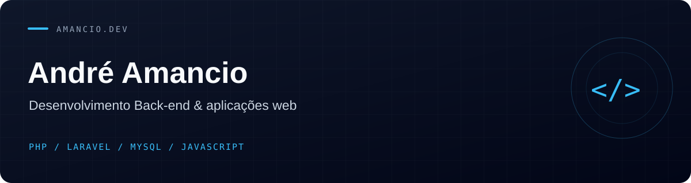

## Olá, eu sou o André

Desenvolvedor com foco em **PHP e Laravel**. Construo aplicações web para organizar processos, conectar informações e facilitar tarefas do dia a dia.

Meus projetos exploram gestão de treinamentos, educação, registros clínicos e organização pessoal — da modelagem do banco de dados à interface.

### Tecnologias presentes nos meus projetos

**Back-end** · PHP · Laravel · APIs REST  
**Dados** · MySQL · SQLite  
**Interfaces** · JavaScript · Blade · React · TypeScript · Tailwind CSS  
**Ferramentas** · Git · GitHub · Composer · Vite

### Projetos em destaque

| Projeto | O que você encontra |
| :--- | :--- |
| [**TrainOps**](https://github.com/amancio-dev/trainops) | Gestão de treinamentos, colaboradores e orçamento com Laravel, React e TypeScript. |
| [**Projeto Aprendiz**](https://github.com/amancio-dev/projetoAprendiz-Laravel) | Gestão de aprendizes, empresas e presença, com diferentes perfis de acesso. |
| [**Sistema Escolar**](https://github.com/amancio-dev/sistemaEscolar) | Organização de alunos, turmas, disciplinas, notas e frequência. |
| [**MyBuy**](https://github.com/amancio-dev/MyBuy) | Controle de compras e orçamento com armazenamento local no navegador. |
| [**Ficha de Amputados**](https://github.com/amancio-dev/fichaAmputados) | Cadastro e consulta de fichas clínicas com Laravel. |

### Evolução dos projetos

Também mantenho experiências de aprendizado e implementações anteriores. O [Projeto Aprendiz em PHP](https://github.com/amancio-dev/projetoaprendiz) e sua [versão em Laravel](https://github.com/amancio-dev/projetoAprendiz-Laravel) mostram essa evolução.

---

[Explore todos os repositórios públicos →](https://github.com/amancio-dev?tab=repositories&type=public)
